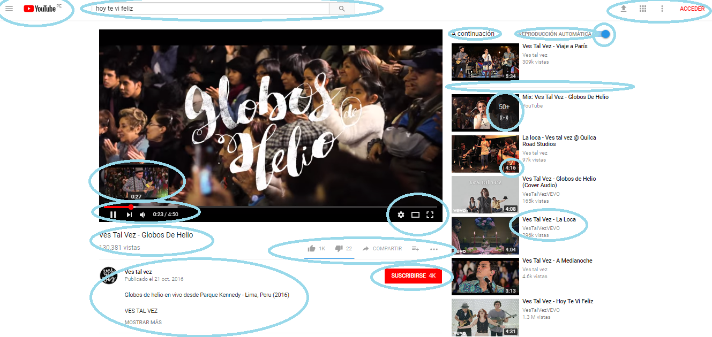

# Identificando elementos de UX & UI

**Curso: Creando un sitio web interactivo con JavaScript**  

**Unidad:  Unidad 3: Intro a User Experience Design**

***

* El reto consiste en:

   * Elegir una página web, en este caso Youtube, y explicar que partes conforman el UX y qué partes el UI.

## Partes de UI

  ### Página de inicio
  
  * Color del background del body. 

  * Color de los íconos. 

  * Opacidad en los videos.

  * Fuente de letra.

  * "50+" y su ícono respectivo.  

  * Los estilos de títulos y subtítulos.

  * Estilos de la indicación de minutos.

  * El estilo de poner el nombre del video en negritas, color negro y mayor tamaño. 

  * La información adicional de los videos en letras normales y de color gris. 

  * Que la palabra "Acceder" se roja. 

  * Menú hamburguesa y contenido. 

  * Que la barra de búsqueda se vea sobria y tenga el ícono de la lupa. 

  * Estilo de la línea separatoria. 

  * Color del Background del menú hamburguesa. 

  * Estilo de botón para el carrusel de videos. 

  

 ### Reproducción de video 

 * Menú hamburguesa. 

 * Que la barra de búsqueda se vea sobria y tenga el ícono de la lupa. 

 * Estilo de la pantalla de reproducción (bordes negros). 

 * Estilos de la ventana del momento de reproducción. 

 * Botones de reproducción y minutos. 

 * Botones de configuración, etc.

 * Color rojo de la reproducción ya vista y gris de lo que ya ha cargado pero aún no hemos visto. 

* Boton de "Suscribirse".

* Forma redonda de la foto del canal. 

* Nombre del canal en negritas y color negro. 

* Datos de publicación en menor tamaño de letra y color gris.

* Información el video en color negro. 

* "Mostrar más" en negritas, mayúsculas y color gris. 

* Estilos de reproducción automática. 

* Estilos de los títulos de los videos. 

* Estilos de la duración de videos.

* "Acontinuación" en color negro y mayor tamaño de fuente. 

* Estilos del Mix "50+". 

* Estilo de la línea separatoria.

* Botones en la parte superior derecha.

* "Acceder" en color rojo, mayúsculas y negrita. 

## Partes de UX 