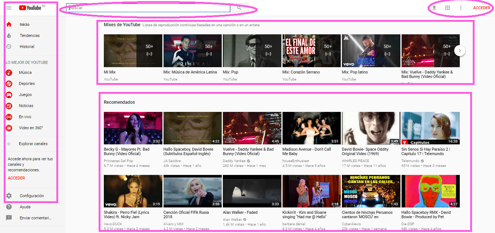
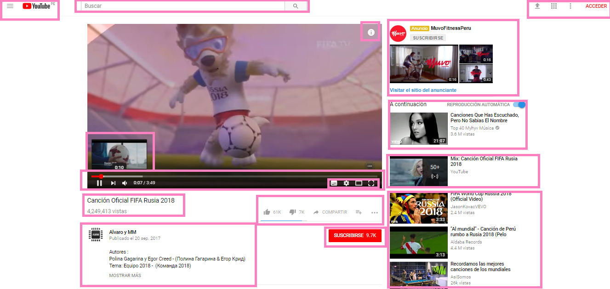

# Identificando elementos de UX & UI

**Curso: Creando un sitio web interactivo con JavaScript**  

**Unidad:  Unidad 3: Intro a User Experience Design**

***

* El reto consiste en:

   * Elegir una página web, en este caso Youtube, y explicar que partes conforman el UX y qué partes el UI.

## Partes de UI

  ### Página de inicio
  
  * Color del background del body. 

  * Color de los íconos. 

  * Opacidad en los videos.

  * Fuente de letra.

  * "50+" y su ícono respectivo.  

  * Los estilos de títulos y subtítulos.

  * Estilos de la indicación de minutos.

  * El estilo de poner el nombre del video en negritas, color negro y mayor tamaño. 

  * La información adicional de los videos en letras normales y de color gris. 

  * Que la palabra "Acceder" se roja. 

  * Menú hamburguesa y contenido. 

  * Que la barra de búsqueda se vea sobria y tenga el ícono de la lupa. 

  * Estilo de la línea separatoria. 

  * Color del Background del menú hamburguesa. 

  * Estilo de botón para el carrusel de videos. 

  

 ### Reproducción de video 

 * Menú hamburguesa. 

 * Que la barra de búsqueda se vea sobria y tenga el ícono de la lupa. 

 * Estilo de la pantalla de reproducción (bordes negros). 

 * Estilos de la ventana del momento de reproducción. 

 * Botones de reproducción y minutos. 

 * Botones de configuración, etc.

 * Color rojo de la reproducción ya vista y gris de lo que ya ha cargado pero aún no hemos visto. 

* Boton de "Suscribirse".

* Forma redonda de la foto del canal. 

* Nombre del canal en negritas y color negro. 

* Datos de publicación en menor tamaño de letra y color gris.

* Información el video en color negro. 

* "Mostrar más" en negritas, mayúsculas y color gris. 

* Estilos de reproducción automática. 

* Estilos de los títulos de los videos. 

* Estilos de la duración de videos.

* "Acontinuación" en color negro y mayor tamaño de fuente. 

* Estilos del Mix "50+". 

* Estilo de la línea separatoria.

* Botones en la parte superior derecha.

* "Acceder" en color rojo, mayúsculas y negrita. 

## Partes de UX 

### Página de inicio

  * Primer menú en la parte de arriba.  

  * Menú hacia el lado izquierdo.  

  * Buscador en el centro.  

  * Orden de las opciones del menú.  

  * Configuración, Ayuda, Comentarios en la parte final del menú.

  * En la esquina superior derecha botones de subir video, ajustes y accder a una cuenta.

  * "Acceder" sea más resaltante.  

  * En la parte central aparezcan mixes de videos y también reocomendaciones.  

  * "Mixes de Youtube" y "Recomendados" se vean resaltantes y estén en ese orden. 

  * Los mixes se basan en reproducciones anteriores del usuario.

  * Cuantas columnas y filas de videos aparecen. 

  * Estructura de la información de los videos (Nombre del video/Canal/Vistas/Tiempo de publicación):

  * Carrusel en los mixes.

  * Incluir el tiempo de duración del video.

  * Marcado con azul si el video ya ha sido visto (en la imagen no aparece).

  * Señalar mi ubicación en el logo "Youtube PE". 

  

 ### Reproducción de video 

 * Ubicación de los elementos. 

 * Tener el menú en opción despegable y no permanente. Nos podemos concentrar en visualizar el video.

 * Señalar mi ubicación en el logo "Youtube PE". 

 * Buscador en el centro de la parte superior.

 * Tener opción de configurar la ventana donde se visualiza el video. Podemos poner del tamaño que queremos según lo que necesitemos.

 * Ventana pequeña que señala que pasará en un minuto. Porque me ayuda a ver lo que necesito y no perder tiempo.

 * Poder tener configruación. En ella hay opciones para poner subtítulos, calidad del video, etc.

 * La 'i' en la esquina superior derecha del video, es una encuesta opcional. El usuario escoge si hacerla o no.

 * Los comerciales solo duran 4 segundos. Es un poco molestoso, pero son solo 4 segundos, si fuesen 5 sería fatal.

 * Los comerciales generan ingresos extras a los dueños de los canales en Youtube. Así los tienen contentos y siguen usando su red por eso los usuarios que nos limitamos a  ver contenido nos sentimos bien de tener qué ver.

 * Poder detener el video, subir y bajar el volumen del audio y pasar a un siguiente video.  

 * La publicidad "permanente" va a un lado y no incomoda.  

 * "A continuación" me avisa que luego e inmediatamente se reproducirá un video relacionado a lo que estoy viendo en ese moemento. Si no, puedo dar click en cualquier otro video o buscar uno nuevo.  

 * Me muestra denuevo un mix, armado en base a lo que estoy viendo o lo que ya he visto. 

 * Nombre del video debajo de la ventana de reproducción.

 * Poder dar like o dislike a un video. Poder compartirlo en redes sociales, añadirlo a una lista, etc.

 * Visualizar el nombre del canal,  publicación, e información.  

 * La opción de suscribirme a un canal. 

