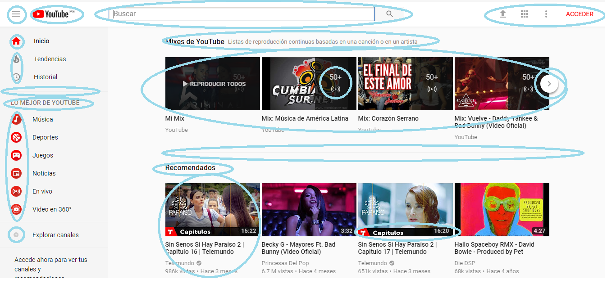

# Identificando elementos de UX & UI

**Curso: Creando un sitio web interactivo con JavaScript**
**Unidad:  Unidad 3: Intro a User Experience Design**

***

* El reto consiste en:

   * Elegir una página web, en este caso Youtube, y explicar que partes conforman el UX y qué partes el UI.

* Partes de UI
  
  * Color del background del body. 

  * Color de los íconos. 

  * Menu hamburguesa y contenido. 

  

* Partes de UX 